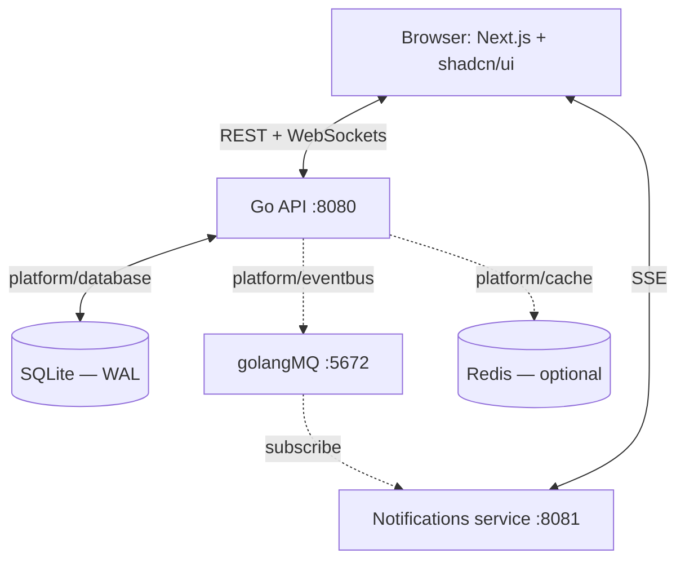

# 🌐 Social Network — Vertical Slices with CQRS


A full-stack social network built as a **reference architecture** for clean vertical-slice design. The Go 1.25 backend is organised so that every feature — domain model, CQRS commands and queries, transport, and storage — lives in exactly one folder. Infrastructure (SQLite/PostgreSQL, Redis, event broker) sits behind abstract interfaces, so swapping any of it requires **zero changes inside a feature slice**.

The point of this repo is not the social network. It is the architecture and the automated gates that keep the architecture honest.

---

## 📖 Table of Contents

- [What it does](#-what-it-does)
- [Architecture](#-architecture)
- [Design decisions (D1–D6)](#core-design-decisions-d1d6)
- [Getting started](#-getting-started)
- [Running with Docker](#-running-with-docker)
- [Running natively](#-running-natively)
- [Ports and endpoints](#-ports-and-endpoints)
- [Project structure](#-project-structure)
- [Quality gates](#-quality-gates)
- [Common commands](#-common-commands)
- [Configuration](#-configuration)
- [Further documentation](#-further-documentation)

---

## 🌟 What it does

| Area | Capabilities |
| :--- | :--- |
| **Auth** | Registration (email, password, name, date of birth), rotating double-cookie sessions (`access_token` + `refresh_token`, `HttpOnly`), OAuth via GitHub and Google, per-user rate limiting |
| **Profiles & follows** | Public/private toggle with confirmation step. Public profiles accept a follow instantly; private profiles raise a follow request the owner can accept or decline |
| **Posts & comments** | Image attachments (JPEG/PNG/GIF, magic-byte validated) and three visibility scopes: `public`, `almost_private` (followers only), `private` (a selected follower set) |
| **Chat** | WebSocket direct and group messaging with a session-token handshake, follow-gating between participants, typing indicators, presence, read receipts, and emoji |
| **Groups & events** | Group creation, follower invitations, join requests, group-exclusive posts, scheduled events with live-synced RSVPs |
| **Notifications** | Dedicated SSE stream for follow requests, group invites, join requests, and event creation |

Real-time is split by purpose: **WebSockets** for chat (bidirectional), **SSE** for notifications (server-to-client only).

---

## 🏗️ Architecture



Three layers, with dependencies pointing in one direction only:

1. **Presentation** — Next.js App Router (port 3001), server and client components, shadcn/ui.
2. **Feature layer** — `internal/<feature>/`. Each slice is self-contained: entity, `commands/` (writes), `queries/` (reads), `transport/`, `store/`.
3. **Platform layer** — `internal/platform/` holds the `database`, `cache`, and `eventbus` interfaces plus their implementations. Features depend on the interface, never on a concrete driver.

Slice-to-slice communication is deliberately narrow (D3): pass **IDs** for data references, define **small local interfaces** for synchronous checks, and publish **events** on the platform bus for side effects. `internal/bootstrap/` is the only composition root — it wires slices to platform implementations and nothing else does.

### Core design decisions (D1–D6)

These are enforced by the gates in `internal/gates/`, not just documented. A pull request that violates them fails CI.

- **D1 — Vertical slices.** All logic for a feature lives in `internal/<feature>/`; writes in `commands/`, reads in `queries/`.
- **D2 — Interface strategy.** Commands and queries accept the full `Repository` interface declared in `<feature>.go`. Cross-slice consumers define their own narrow interfaces, satisfied implicitly through Go's structural typing.
- **D3 — Communication.** ID-only references, narrow local interfaces for sync checks, platform event bus for mutation side effects.
- **D4 — Database access.** Feature stores accept `platform/database.DB` interfaces, never a raw `*sql.DB`. The factory switches SQLite (WAL + busy timeout) and PostgreSQL at runtime.
- **D5 — Boundary rules.** Feature logic and `commands/`/`queries/` **must not** import their own `transport/` or `store/`, nor the `transport/`/`store/` of another feature.
- **D6 — Dependency graph.** The import tree must stay acyclic. `user` and `session` sit at the bottom; `notification` is a pure subscriber with zero feature imports. Verified by `go-arch-lint` as well as the custom gate.

Full rationale lives in [.agents/rules/conventions.md](.agents/rules/conventions.md).

---

## 🚀 Getting started

### Prerequisites

| Tool | Version | Needed for |
| :--- | :--- | :--- |
| [Go](https://go.dev/dl/) | 1.25+ | Backend, gates, all tooling |
| [Bun](https://bun.sh/install) | latest | Frontend deps and dev server |
| Docker + Compose | v2+ | Container stack, **and** the broker for native runs |
| `sqlite3` CLI | any | `make seed` / `make db-reset` only |
| `openssl` | any | Certificate generation |

### Install

```bash
make install
```

One deterministic command that runs, in order:

1. `go mod download` — Go dependencies pinned by `go.sum`
2. `cp .env.example .env` — if `.env` does not already exist
3. `bash scripts/makecerts.sh` — self-signed TLS cert for `localhost` into `certs/`
4. `make tools` — pinned `gofumpt`, `goimports`, `staticcheck`, `golangci-lint`, `govulncheck`, `gosec`, `go-arch-lint`, `benchstat`
5. `make setup-hooks` — `lefthook install` for the pre-commit and pre-push hooks
6. `bun install` in `frontend-next/`

If you only want the Go toolchain and hooks, use `make setup`.

---

## 🐳 Running with Docker

The full stack — backend, frontend, notifications, and broker — in four containers:

```bash
make docker-dev     # or: make dev
```

Equivalent to `docker compose -f docker-compose.yml -f docker-compose.dev.yml up --build`. The dev overlay mounts migrations and seeds, enables debug logging, and points the broker at the compose network.

| Command | Effect |
| :--- | :--- |
| `make docker-dev` | Build and start the dev stack with hot reload |
| `make docker-down` | Stop the services |
| `make docker-clean` | Remove containers, volumes, and locally built images |
| `make docker-db` | Open a SQLite shell inside the running backend container |

OAuth is optional. To enable GitHub or Google sign-in, put real credentials in the `GITHUB_*` / `GOOGLE_*` keys of `docker-compose.yml`, or set them in `.env` for the native path.

---

## 💻 Running natively

```bash
make run-all       # or: make run
```

This starts four processes and tears the whole tree down on `Ctrl+C`:

| Process | Command | Listens on |
| :--- | :--- | :--- |
| Message broker | `docker run danielkotsi/golangmq` (waits for readiness) | `localhost:5672` |
| Notifications | `go run` in `services/notifications` | `localhost:8081` |
| Backend API | `go run cmd/server/main.go` | `localhost:8080` |
| Frontend | `bun run dev` in `frontend-next` | `localhost:3001` |

Note that native mode still needs Docker, because the broker only ships as a container. Run `make run-broker` on its own if you want the broker without the rest.

To run a single piece:

```bash
make run-backend        # API only
make run-notifications  # notifications service only
make run-frontend       # frontend only
```

### Building instead of running

```bash
make build          # backend binary -> bin/server, plus the Next.js production build
make build-backend
make build-frontend
```

### Database

Migrations run automatically on boot (`DB_MIGRATE_ON_START=true`). To reset to a known state:

```bash
make db-reset   # drops db/data, recreates the schema, loads db/seeds/dev_data.sql
```

---

## 🔌 Ports and endpoints

| Service | Native | Docker |
| :--- | :--- | :--- |
| Frontend | http://localhost:3001 | http://localhost:3001 |
| Backend API | **https**://localhost:8080 | http://localhost:8080 |
| Health check | https://localhost:8080/api/v1/health | http://localhost:8080/api/v1/health |
| Notifications | http://localhost:8081 | http://localhost:8081 |
| Broker | localhost:5672 | localhost:5672 |

The API is namespaced under `/api/v1`. Native runs serve HTTPS because `.env` points `SERVER_TLS_CERT_FILE` and `SERVER_TLS_KEY_FILE` at the generated certs; Docker clears both, so the container serves plain HTTP. The native browser will warn once about the self-signed certificate.

The notifications service verifies session cookies against the backend, so it needs `NOTIFICATIONS_BACKEND_URL` reachable from wherever it runs. In Docker the frontend proxies to it; natively the frontend dials `http://localhost:8081` directly (`NEXT_PUBLIC_NOTIFICATIONS_ORIGIN`), because the Next.js proxy buffers `text/event-stream` frames indefinitely and would stall the live stream.

---

## 📂 Project structure

```
.
├── cmd/
│   ├── server/              # API entry point
│   └── gates/               # CLI runner for the verification gates
├── db/
│   ├── migrations/          # 14 sequential up/down SQL pairs
│   └── seeds/               # dev_data.sql
├── frontend-next/           # Next.js 16 App Router frontend
├── services/
│   └── notifications/       # standalone SSE + notification store
├── internal/
│   ├── user/                # registration, profiles, privacy toggle
│   ├── follow/              # relationships, pending requests
│   ├── topic/               # posts, feed visibility, votes
│   ├── comment/             # image-supported comments
│   ├── group/               # communities, group posts, group chat
│   ├── event/               # group events, RSVP tracking
│   ├── chat/                # direct messages, presence, history
│   ├── oauth/               # GitHub and Google pipelines
│   ├── core/                # middleware, websocket hub, server, sessions
│   ├── platform/            # database, cache, eventbus abstractions
│   ├── gates/               # the gate implementations
│   ├── bootstrap/           # composition root
│   ├── config/              # env loader
│   └── pkg/                 # shared helpers: uuid, imgutil, request/response helpers
└── pkg/oauth/               # GitHub, Google, shared HTTP client
```

---

## 🧪 Quality gates

Architecture rules that are only documented are rules that get broken. `internal/gates/` turns the D1–D6 decisions above into executable checks.

```bash
make gates        # equivalent to: go run cmd/gates/main.go --all
```

Run one at a time with `go run cmd/gates/main.go --gate=<name>`:

| Gate | Checks |
| :--- | :--- |
| `stack` | Go version and module path |
| `d1-layout` | Vertical-slice directory structure |
| `d5-boundaries` | No cross-slice `transport/` or `store/` imports |
| `d6-dag` | Acyclic import graph (cross-checked with `go-arch-lint`) |
| `tdd` | Test file presence per slice |
| `migrations` | Migration naming and delimiter format |
| `security` | `gosec`, `govulncheck`, and custom AST rules |
| `branch` | Branch naming convention |
| `coverage-delta` | Coverage threshold on changed code |
| `scope-drift` | Unrelated changes sneaking into a diff |
| `format` | `gofumpt` and `goimports` |
| `lint` | `golangci-lint`, `staticcheck`, `go vet` |
| `go-test` | Unit tests |
| `frontend` | Frontend lint, format, `tsc`, and tests |

Add `--json` for machine-readable output; `--plain` for terse text. Exit code is `0` on success, `1` on failure.

**Git hooks.** `make setup-hooks` installs lefthook. Pre-commit formats staged Go with `gofumpt`/`goimports` and runs ESLint and Prettier on the frontend, staging any fixes. Pre-push runs the full gate suite:

```
go run ./cmd/gates/ --all --plain
```

Bypass with `git commit --no-verify` or `git push --no-verify` when you must.

---

## 🛠️ Common commands

```bash
make help          # list every target

# build and run
make build         make run-all      make docker-dev     make docker-down

# quality
make gates         make test         make test-short    make lint
make format        make check-format make staticcheck   make check-arch
make ci            # full pipeline: tidy + format + lint + test, backend and frontend

# database
make db-reset      make seed         make db-clean
```

The frontend has its own scripts, run from `frontend-next/`:

```bash
bun run dev            bun run lint          bun run format:check
bun run build          bun run type-check    bun run test
```

Note the hyphen in `type-check`. `make fe-ci` wires the four CI-relevant ones together.

---

## ⚙️ Configuration

`make install` copies `.env.example` to `.env`. The values that matter most:

| Variable | Default | Purpose |
| :--- | :--- | :--- |
| `SERVER_PORT` | `8080` | API port |
| `SERVER_TLS_CERT_FILE` / `SERVER_TLS_KEY_FILE` | `certs/localhost+2{,-key}.pem` | Leave set for native HTTPS, clear for plain HTTP |
| `SERVER_API_CONTEXT_V1` | `/api/v1` | Route prefix |
| `DB_DRIVER` | `sqlite3` | `sqlite3` or `postgres` |
| `DB_PATH` | `db/data/forum.db` | SQLite file location |
| `DB_MIGRATE_ON_START` | `true` | Run migrations on boot |
| `DB_SEED_ON_START` | `true` | Load seed data on boot |
| `DB_PRAGMA` | `_foreign_keys=on&_journal_mode=WAL&_busy_timeout=5000` | SQLite pragmas |
| `SESSION_SECURE_COOKIE` | `true` | Set `false` when serving plain HTTP locally |
| `ALLOWED_ORIGINS` | — | Comma-separated CORS allowlist |
| `NEXT_PUBLIC_NOTIFICATIONS_ORIGIN` | empty | Set to `http://localhost:8081` for native dev |
| `NOTIFICATIONS_BROKER_URL` | `localhost:5672` | Broker address |
| `GITHUB_CLIENT_ID` / `GOOGLE_CLIENT_ID` (+ `_SECRET`) | empty | OAuth; leave empty to disable |

`make install` generates the certificate only if `.env` exists, so if you skip that step the native server falls back to plain HTTP.

---

## 📚 Further documentation

Read in this order:

1. [AGENTS.md](AGENTS.md) — working rules for humans and coding agents
2. [.agents/rules/conventions.md](.agents/rules/conventions.md) — architectural conventions
3. [docs/architecture/architecture.md](docs/architecture/architecture.md) — system architecture
4. [docs/architecture/sds.md](docs/architecture/sds.md) — design specification
5. [docs/architecture/DEVELOPMENT.md](docs/architecture/DEVELOPMENT.md) — development workflow
6. [docs/architecture/target-architecture-with-phases.md](docs/architecture/target-architecture-with-phases.md) — roadmap
7. [docs/sprints/](docs/sprints/) — sprint plans and the [ticket tracker](docs/sprints/ticket-tracker.md)

---

## 📄 License

[MIT](LICENSE)
